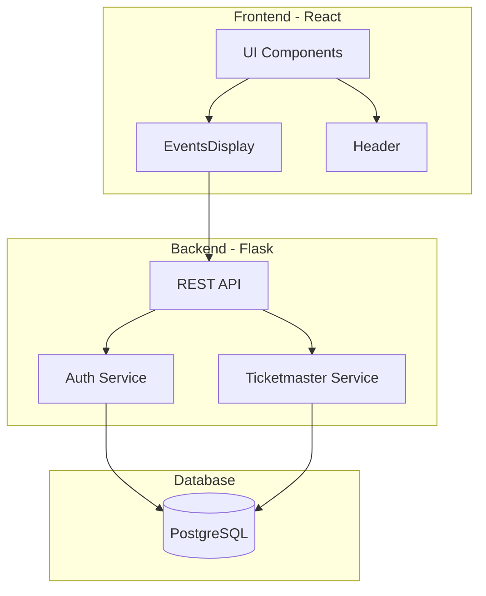

# Las Vegas AI Technical Architecture Document
Version 1.0 - February 14, 2025

## Table of Contents
1. System Overview
2. Architecture Diagram
3. Frontend Architecture
4. Backend Architecture
5. Database Schema
6. Technical Specifications
7. Documentation Standards

## 1. System Overview

Las Vegas AI is a recommendation system for Las Vegas events and attractions. The system currently:
- Integrates with Ticketmaster's API for event data
- Provides user authentication with 2FA
- Displays events with filtering capabilities
- Supports basic recommendations

Key Features (Currently Implemented):
- Event discovery from Ticketmaster
- User authentication with 2FA security
- Basic event filtering and display
- PostgreSQL data persistence

## 2. Architecture Diagram



## 3. Frontend Architecture

### 3.1 Component Structure
```typescript
// Currently Implemented Components
- App.tsx (Main container)
- Header.tsx (Navigation)
- EventsDisplay.tsx (Event grid)
- types/ (Type definitions)
```

### 3.2 API Integration
```typescript
// src/api/recommendations.ts
export async function getRecommendations() {
    const response = await fetch("http://localhost:5001/api/recommendations", {
        method: "GET",
        credentials: "include",
        headers: { "Content-Type": "application/json" },
    });
    
    if (!response.ok) {
        throw new Error("Failed to fetch recommendations");
    }
    
    return response.json();
}
```

## 4. Backend Architecture

### 4.1 Current API Endpoints
```python
# Authentication
@app.route("/api/auth/login", methods=["POST"])
@app.route("/api/auth/logout", methods=["POST"])

# Events & Recommendations
@app.route("/api/events", methods=["GET"])
@app.route("/api/recommendations", methods=["GET"])
@app.route("/view-recommendations", methods=["GET"])

# Base route
@app.route("/")
```

### 4.2 Database Models
```python
class User(db.Model):
    __tablename__ = 'users'
    id = db.Column(UUID(as_uuid=True), primary_key=True, default=uuid.uuid4)
    username = db.Column(db.String(80), unique=True, nullable=False)
    password_hash = db.Column(db.String(128), nullable=False)
    otp_secret = db.Column(db.String(64), nullable=False)
    created_at = db.Column(db.DateTime, default=datetime.utcnow)

class Event(db.Model):
    __tablename__ = 'events'
    id = db.Column(db.Integer, primary_key=True)
    external_id = db.Column(db.String(255), unique=True)
    name = db.Column(db.String(255), nullable=False)
    description = db.Column(db.Text)
    category = db.Column(db.String(100))
    subcategory = db.Column(db.String(100))
    price_range_min = db.Column(db.Numeric(10, 2))
    price_range_max = db.Column(db.Numeric(10, 2))
    venue = db.Column(db.String(255))
    start_date = db.Column(db.DateTime)
    end_date = db.Column(db.DateTime)
    image_url = db.Column(db.Text)
    source = db.Column(db.String(50))
    rating = db.Column(db.Numeric(3, 2))
    created_at = db.Column(db.DateTime, default=datetime.utcnow)
```

## 5. Technical Specifications

### 5.1 Environment Variables
```bash
# Backend (.env)
FLASK_APP=app.py
FLASK_ENV=development
DB_USER=myuser
DB_PASSWORD=mypassword
DB_NAME=las_vegas_db
DB_HOST=localhost
DB_PORT=5432
TICKETMASTER_API_KEY=your_key_here
```

### 5.2 Dependencies

#### Frontend
```json
{
  "dependencies": {
    "react": "^18.2.0",
    "react-dom": "^18.2.0",
    "lucide-react": "^0.475.0",
    "tailwindcss": "^3.4.1"
  }
}
```

#### Backend
```
flask
flask-sqlalchemy
flask-migrate
flask-cors
flask-bcrypt
pyotp
psycopg2-binary
python-dotenv
```

## 6. Development Setup

### 6.1 Local Development
```bash
# Backend
cd backend
source venv/bin/activate
export FLASK_APP=app.py
flask run --port=5001

# Frontend
cd frontend
npm install
npm run dev
```

### 6.2 Database Setup
```sql
CREATE USER myuser WITH PASSWORD 'mypassword';
ALTER USER myuser CREATEDB;
CREATE DATABASE las_vegas_db OWNER myuser;
```

## 7. Future Enhancements (Planned)

1. Event Search & Filtering
   - Advanced search functionality
   - Category-based filtering
   - Price range filtering

2. Caching Layer
   - Implement Redis caching
   - Cache frequently accessed data

3. Enhanced Recommendations
   - Personalized recommendations based on user preferences
   - Collaborative filtering
   - Trending events

4. User Interactions
   - Event bookmarking
   - User reviews
   - Interaction history

## 8. Documentation Standards

### Code Documentation
- Python: Google-style docstrings
- TypeScript: JSDoc comments
- Clear naming conventions
- Regular code comments for complex logic

### API Documentation
- Clear endpoint descriptions
- Request/response examples
- Error scenarios documented