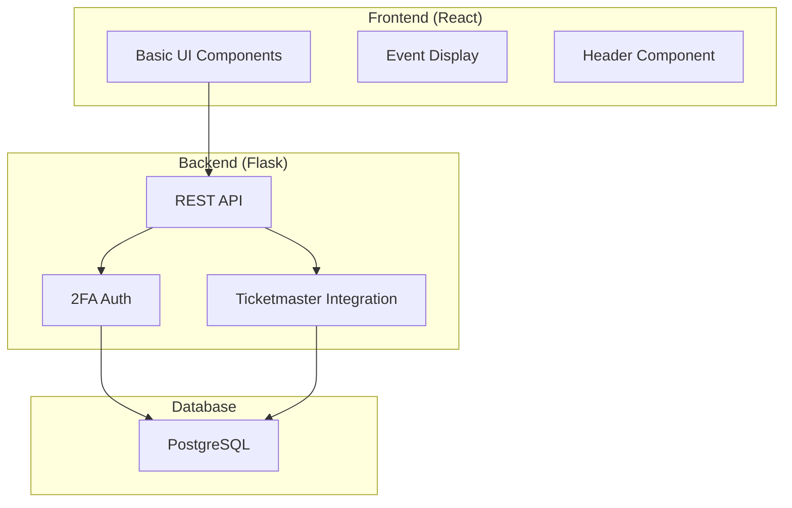

# Las Vegas AI Project Brief
## AI Collaboration Guide - February 14, 2025

## Project Overview
Las Vegas AI is a recommendation system providing personalized event suggestions for Las Vegas visitors. The system uses Ticketmaster's API for event data and implements user authentication with 2FA.

## Current Implementation Status


### Existing Components
1. **Frontend** (Port 5173)
   ```typescript
   // Basic structure:
   src/
   ├── components/
   │   ├── Header.tsx
   │   └── EventsDisplay.tsx
   ├── types/
   │   └── event.ts
   └── App.tsx
   ```

2. **Backend** (Port 5001)
   ```python
   # Core endpoints:
   @app.route("/api/events")
   @app.route("/api/recommendations")
   @app.route("/api/auth/login")
   ```

3. **Database**
   ```sql
   -- Core tables:
   users
   events
   user_preferences
   user_interactions
   ```

## AI Assistant Assignments

### ChatGPT (Frontend Focus)
**Objective:** Enhance user interface and experience

**Tasks:**
1. Implement advanced event filtering:
   ```typescript
   interface EventFilters {
     category?: string;
     priceRange?: [number, number];
     date?: DateRange;
     venue?: string;
   }
   ```

2. Create user profile pages:
   ```typescript
   // Pages to implement:
   - /profile/settings
   - /profile/preferences
   - /profile/history
   ```

3. Add error boundaries:
   ```typescript
   class GlobalErrorBoundary extends React.Component {
     // Implement error catching
   }
   ```

**Starting Point:**
- Review current components in `src/components/`
- Start with EventsDisplay.tsx enhancements
- Use existing types from `src/types/`

### Deepseek (Backend Focus)
**Objective:** Enhance data processing and recommendations

**Tasks:**
1. Expand Ticketmaster integration:
   ```python
   class TicketmasterService:
       def fetch_events(self):
           # Implement pagination
           # Add error handling
           # Add data normalization
   ```

2. Implement recommendation engine:
   ```python
   class RecommendationEngine:
       def get_personalized_recommendations(self, user_id):
           # Based on user preferences
           # Based on past interactions
   ```

3. Add basic caching:
   ```python
   def cache_recommendations(user_id, recommendations):
       # Implement in-memory caching first
       # Plan for Redis later
   ```

**Starting Point:**
- Examine current `app.py`
- Focus on `ingest_data.py`
- Review existing models

### Gemini (Integration Focus)
**Objective:** Implement search and analytics

**Tasks:**
1. Create search functionality:
   ```python
   @app.route("/api/events/search")
   def search_events():
       # Implement search logic
       # Add filters
   ```

2. Add analytics tracking:
   ```typescript
   interface UserInteraction {
     eventId: string;
     action: 'view' | 'like' | 'bookmark';
     timestamp: Date;
   }
   ```

3. Build analytics dashboard:
   ```typescript
   // Components needed:
   - InteractionChart
   - PopularEvents
   - UserMetrics
   ```

**Starting Point:**
- Review both frontend and backend code
- Start with search API implementation
- Plan analytics schema

## Development Guidelines

### Setup Instructions
1. Frontend:
   ```bash
   cd frontend
   npm install
   npm run dev
   ```

2. Backend:
   ```bash
   cd backend
   source venv/bin/activate
   pip install -r requirements.txt
   flask run --port=5001
   ```

### Key Dependencies
```json
{
  "frontend": {
    "react": "^18.2.0",
    "typescript": "^4.9.0",
    "tailwindcss": "^3.4.1"
  },
  "backend": {
    "flask": "latest",
    "flask-sqlalchemy": "latest",
    "psycopg2-binary": "latest"
  }
}
```

### Communication Protocol
1. Each AI should create a checkpoint after significant changes
2. Use the following format for checkpoints:
   ```markdown
   📝 Checkpoint #[number] – [focus area]
   📅 Date: [date]
   🧩 Completed: [list]
   ⏳ In Progress: [list]
   🔜 Next Steps: [list]
   ```

### Code Standards
- Frontend: Use TypeScript, functional components
- Backend: Follow PEP 8, use type hints
- All: Document code thoroughly

## Getting Started
1. Review your assigned area
2. Create initial checkpoint
3. Start with highest priority task
4. Update checkpoint after major changes

## Next Steps
Each AI should acknowledge this brief and provide:
1. Understanding of assigned tasks
2. Initial approach plan
3. Any clarifying questions
4. First checkpoint